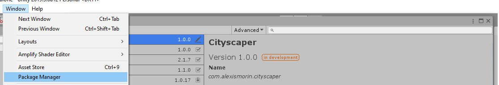

# Cityscaper
## Unity Skybox Detail Geometry Tool

In almost every single project I worked on that involves a view of the outside world through a window I end up requiring some sort of low-overhead, large scale detail geometry for my skybox environment. After making a bunch repeatedly, I decided that I would make a tool so I would never have to do it again!

### Usage

After install, just drag the *Cityscaper* prefab from the package folder and get going!

- The **Urban Density** slider affects the ratio of city-to-nature.
- The **Voxel Size** slider controls the space between each spawned item. The default value is fine but you might want to adjust it for performance or the size of your buildings.
- The **Noise Magnitude** slider controls how noisy the generated city/surrounding foliage will be. Low values give you vineyards and Manhattan and higher values just sparse medieval towns.
- The **Building** and **Nature** prefab arrays contain which actual meshes will be spawned. Feel free to use the ones included as-is, or just pluck in your own meshes for easy customization. Special shaders that randomize the features of buildings and trees are included in the project - simply color the vertex colors of the roofs white when authoring your own meshes.

### Installation

This is a plugin that makes use of Unity's *Package Manager* feature. Just drop the *com.alexismorin.cityscaper* folder (found in the *packages* folder of the Unity project) into your own project's *packages* folder (found at the same level as your Assets folder) and it should work out-of-the-box. If you're using a pre-packman version of Unity (phew!), navigate inside the *com.alexismorin.cityscaper* folder and then just drag the *Editor* folder you find there anywhere in your project hierarchy.

Per usual, enjoy this package full of bugs authored in a couple of hours!
